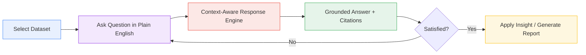

<div align="center">


# SignalForge AI

### Turning Data into Smarter Decisions

<p align="center">
  <em>A premium decision-intelligence workspace for uploading spreadsheets, running statistical forecasts, chatting with your data, and exporting executive briefs — built with Next.js 15, React 19, and Supabase.</em>
</p>

---

[](https://nextjs.org/)
[](https://react.dev/)
[](https://www.typescriptlang.org/)
[](https://tailwindcss.com/)
[](https://supabase.com/)
[](https://www.framer.com/motion/)
[](https://recharts.org/)
[](LICENSE)
[](CONTRIBUTING.md)

<p>
  <a href="#-features">Features</a> •
  <a href="#-quick-start">Quick Start</a> •
  <a href="#-project-structure">Structure</a> •
  <a href="#-screenshots">Screenshots</a> •
  <a href="#-team">Team</a>
</p>

</div>

---

## 📖 Overview

**SignalForge AI** is an advanced decision-intelligence dashboard that helps enterprise teams upload CSV/Excel data, run statistical forecasting, export PDF reports, and chat with their data in real-time using context-aware AI. The product ships as a polished, single-tenant web application with a marketing site and a multi-page workspace.

The app is designed around the idea that **decision-makers shouldn't need SQL or BI tools** to get answers from their data. Instead, they upload a spreadsheet, pick a metric, and either (a) let the forecasting engine project it forward using least-squares regression, (b) ask the context-aware chat assistant a question, or (c) auto-generate a synthesized executive brief they can export to PDF.

> Built by **KrissDevHub Technologies** as a Gen AI Academy APAC prototype submission under the theme _"AI for Better Living and Smarter Communities."_

---

## ✨ Features

### 🗄️ Client-Side Dataset Engine
- **Drag-and-drop CSV / Excel uploads** with no backend round-trip — parsing happens entirely in the browser via `FileReader` + custom regex tokenizers.
- **Automatic schema inference** — columns auto-classified as `number`, `string`, or `date`.
- **Live cell preview** and row counts.
- Supports files up to ~100 MB.

### 🧠 Context-Aware AI Chat
- Ask plain-English questions about the currently selected dataset (e.g. *"Summarize Q2 sales performance"*, *"Which channel has the most expensive CAC?"*, *"List all headers"*).
- Generates context-aware responses grounded in the active dataset's metadata and preview rows.
- Streams markdown responses and renders comparative tables inline.
- Citations to source datasets so you always know where an answer came from.

### 📈 Least-Squares Forecasting
- Project any numeric column forward N steps using **linear** or **exponential** regression.
- Computes **R² accuracy fit**, **growth rate**, and **residual standard error**.
- Confidence corridor visualization with reference lines on the historical/forecast boundary.
- Live, in-browser computation — no external API calls.

### 📑 Automated Executive Reports
- One-click synthesis of an executive brief from the selected dataset.
- Multi-section report with key metrics, narrative summary, and statistical findings.
- **PDF export** (browser-native `window.print` with print-optimized CSS).
- **Confetti celebration** on successful generation (because shipping should feel good).

### 🔐 Multi-Tenant Security Model
- **Supabase Auth** with email/password sign-in and session persistence.
- **Row-Level Security (RLS) policies** at the database layer — every table is isolated by `org_id`.
- **Role-Based Access Control** with three roles: `Admin`, `Editor`, `Viewer`.
  - Admins: full control (members, API keys, billing, datasets, reports).
  - Editors: upload datasets, generate reports, no member management.
  - Viewers: read-only access to dashboards and reports.
- **Rotatable API keys** for programmatic access.

### 🎨 Premium "Deep Space" Design System
- Custom dark theme: Obsidian background (`#05070D`), Cobalt Blue accent (`#3B82F6`), Silver White text (`#F8FAFC`).
- **Plus Jakarta Sans** (sans-serif) + **Instrument Serif** (italic display headings) editorial pairing.
- Glassmorphism panels, glow borders, custom scrollbars.
- Framer Motion animations (slide-up, fade-in, spring transitions) across every page.
- Print-optimized CSS for clean PDF report exports.

### ⚡ Productivity Features
- **Command Palette** (`⌘K` / `Ctrl+K`) — quick navigation, API key generation, and actions from anywhere.
- **In-app notifications** with success/info/warning/error severity.
- **Collapsible sidebar** with persistent state.
- **Mobile-responsive** layouts across marketing and dashboard surfaces.

### 🌐 Full Marketing Site
- Home page with hero, bento feature grid, live ROI calculator, pricing teaser.
- Dedicated pages: Features, Solutions, Pricing, Security, Customers, API Docs, Docs, Blog, Changelog, Roadmap, FAQ, Careers, Contact, About, Integrations, Privacy, Terms, Register.
- Sticky navbar with scroll-aware backdrop blur.
- Footer with link taxonomy.

---

## 🛠️ Tech Stack

| Layer | Technology | Purpose |
|-------|-----------|---------|
| **Framework** | [Next.js 15.1](https://nextjs.org/) (App Router) | Server components, route groups, SSR |
| **UI Runtime** | [React 19](https://react.dev/) | Concurrent rendering, hooks |
| **Language** | [TypeScript 5.6](https://www.typescriptlang.org/) | End-to-end type safety |
| **Styling** | [Tailwind CSS 3.4](https://tailwindcss.com/) | Utility-first theming with custom design tokens |
| **Fonts** | Plus Jakarta Sans + Instrument Serif | Editorial sans + italic display serif |
| **Animation** | [Framer Motion 11](https://www.framer.com/motion/) | Spring physics, layout animations |
| **Charts** | [Recharts 2.13](https://recharts.org/) | Area, line, and reference-line charts |
| **Icons** | [lucide-react](https://lucide.dev/) | 460+ tree-shaken icons |
| **Auth & DB** | [Supabase 2.x](https://supabase.com/) (`@supabase/supabase-js` + `@supabase/ssr`) | Auth, Postgres, RLS |
| **Effects** | [canvas-confetti](https://github.com/catdad/canvas-confetti) | Report generation celebration |
| **Utilities** | `clsx` + `tailwind-merge` | Conditional class composition |
| **Linting** | ESLint 9 + `eslint-config-next` | Code quality |

---

## 🚀 Quick Start

### Prerequisites

| Tool | Version |
|------|---------|
| Node.js | 18.18+ or 20+ |
| npm | 9+ (or pnpm / yarn) |
| Supabase account | Free tier works |

### 1. Clone & Install

```bash
git clone https://github.com/RohitDeore96/SignalForge-AI.git
cd SignalForge-AI
npm install
```

### 2. Configure Environment

Create a `.env.local` file in the project root:

```bash
# Supabase (required for auth & multi-tenant data)
NEXT_PUBLIC_SUPABASE_URL=https://your-project.supabase.co
NEXT_PUBLIC_SUPABASE_ANON_KEY=your-anon-key
```

> **Don't have Supabase yet?** The app gracefully falls back to a mock client when these are missing — you can explore the dashboard with sample datasets, but auth and persistence won't work. To enable full functionality, [create a free Supabase project](https://supabase.com/dashboard).

### 3. Initialize Database

Run the SQL migration in your Supabase SQL Editor:

```bash
# Copy the contents of supabase/schema.sql and execute it in Supabase SQL Editor
# This creates: organizations, profiles, datasets, reports, api_keys tables
# Plus all RLS policies for tenant isolation
```

### 4. Run the Dev Server

```bash
npm run dev
# → Open http://localhost:3000
```

### Available Scripts

| Command | Description |
|---------|-------------|
| `npm run dev` | Start dev server on port 3000 |
| `npm run build` | Production build |
| `npm run start` | Start production server |
| `npm run lint` | Run ESLint |

---

## 📁 Project Structure

```
SignalForge-AI/
├── public/
│   └── logo.png                          # Brand logo (referenced in sidebar, navbar, login)
│
├── src/
│   ├── app/
│   │   ├── layout.tsx                    # Root layout (fonts + AppProvider)
│   │   ├── globals.css                   # Tailwind + print styles + glow borders
│   │   ├── login/page.tsx                # Supabase auth login screen
│   │   │
│   │   ├── (marketing)/                  # Public marketing site (route group)
│   │   │   ├── layout.tsx                # Marketing shell: navbar + footer
│   │   │   ├── page.tsx                  # Home: hero, bento features, ROI calculator, pricing
│   │   │   ├── features/page.tsx
│   │   │   ├── solutions/page.tsx
│   │   │   ├── pricing/page.tsx
│   │   │   ├── security/page.tsx
│   │   │   ├── customers/page.tsx
│   │   │   ├── integrations/page.tsx
│   │   │   ├── api-docs/page.tsx
│   │   │   ├── docs/page.tsx
│   │   │   ├── blog/page.tsx
│   │   │   ├── changelog/page.tsx
│   │   │   ├── roadmap/page.tsx
│   │   │   ├── faq/page.tsx
│   │   │   ├── careers/page.tsx
│   │   │   ├── contact/page.tsx
│   │   │   ├── about/page.tsx
│   │   │   ├── register/page.tsx
│   │   │   ├── privacy/page.tsx
│   │   │   └── terms/page.tsx
│   │   │
│   │   └── (dashboard)/                  # Authenticated workspace (route group)
│   │       ├── layout.tsx                # Workspace shell: sidebar + navbar + Cmd+K
│   │       ├── dashboard/page.tsx        # KPI cards, decision velocity chart
│   │       ├── datasets/page.tsx         # Upload + manage CSV/Excel datasets
│   │       ├── forecasting/page.tsx      # Least-squares regression + chart
│   │       ├── chat/page.tsx             # Context-aware AI chat assistant
│   │       ├── reports/page.tsx          # Executive brief generator + PDF export
│   │       └── settings/page.tsx         # Org, members, API keys, notifications
│   │
│   ├── components/
│   │   ├── navigation/
│   │   │   ├── marketing-navbar.tsx      # Sticky scroll-aware marketing nav
│   │   │   ├── marketing-footer.tsx      # Marketing site footer
│   │   │   ├── navbar.tsx                # Workspace top bar
│   │   │   └── sidebar.tsx               # Collapsible workspace sidebar
│   │   │
│   │   └── ui/
│   │       ├── button.tsx                # Variant-driven button (default, accent, outline)
│   │       ├── card.tsx                  # Card primitives (Card, CardHeader, CardContent...)
│   │       ├── chart.tsx                 # Recharts config + custom tooltip
│   │       ├── command-palette.tsx       # ⌘K global command palette
│   │       ├── context-menu.tsx          # Right-click context menu
│   │       ├── dialog.tsx                # Modal dialog
│   │       └── ...                       # (more primitives)
│   │
│   └── lib/
│       ├── context.tsx                   # AppProvider — global state (user, datasets, chat, etc.)
│       ├── font.ts                       # Plus Jakarta Sans + Instrument Serif loaders
│       ├── supabase.ts                   # Supabase client + config check
│       └── utils.ts                      # cn() class merge helper
│
├── supabase/
│   └── schema.sql                        # Full DB schema + RLS policies (ready to run)
│
├── next.config.ts                        # Next.js config (TS + ESLint bypass for builds)
├── tsconfig.json                         # TypeScript config (strict, path aliases @/*)
├── tailwind.config.ts                    # Custom design tokens (colors, shadows, animations)
├── postcss.config.js
├── package.json
└── README.md
```

---

## 🧭 Application Routes

### Marketing Site (Public)

| Route | Purpose |
|-------|---------|
| `/` | Home — hero, bento features, ROI calculator, pricing teaser |
| `/features` | Full feature catalog |
| `/solutions` | Industry use cases |
| `/pricing` | Starter ($0) vs Business ($149/mo) tiers |
| `/security` | RLS, RBAC, and compliance overview |
| `/customers` | Customer testimonials |
| `/integrations` | Integration partners |
| `/api-docs` | API console documentation |
| `/docs` | User documentation |
| `/blog` | Engineering blog |
| `/changelog` | Release notes |
| `/roadmap` | Public roadmap |
| `/faq` | Common questions |
| `/careers` | Open roles |
| `/contact` | Sales contact form |
| `/about` | Company story |
| `/register` | Sign-up flow |
| `/privacy` | Privacy policy |
| `/terms` | Terms of service |

### Dashboard Workspace (Authenticated)

| Route | Purpose |
|-------|---------|
| `/login` | Supabase auth login |
| `/dashboard` | KPI overview — optimized decisions, confidence index, data nodes |
| `/datasets` | Upload, preview, and manage CSV/Excel files |
| `/forecasting` | Run least-squares regression (linear / exponential) |
| `/chat` | Context-aware AI chat assistant |
| `/reports` | Generate and export executive briefs (PDF) |
| `/settings` | Organization, members, API keys, notifications |

---

## 🎯 Core Workflows

### Workflow 1: Upload → Forecast → Export

```mermaid
flowchart LR
    A[CSV/Excel File] --> B[Browser FileReader]
    B --> C[Schema Inference]
    C --> D[Dataset in Workspace]
    D --> E[Pick Target Column]
    E --> F[Least-Squares Regression]
    F --> G[R² + Forecast Chart]
    G --> H[Export PDF Report]

    style A fill:#E8F0FE,stroke:#3B82F6
    style B fill:#E6F4EA,stroke:#34A853
    style C fill:#FEF7E0,stroke:#FBBC04
    style D fill:#F3E8FD,stroke:#9334E6
    style E fill:#FCE8E6,stroke:#EA4335
    style F fill:#FCE8E6,stroke:#EA4335
    style G fill:#E8F0FE,stroke:#3B82F6
    style H fill:#E6F4EA,stroke:#34A853
```



### Workflow 2: Chat with Your Data



---

## 🗄️ Database Schema

The Supabase schema (`supabase/schema.sql`) defines a multi-tenant model with full Row-Level Security:

| Table | Purpose | RLS Enabled |
|-------|---------|-------------|
| `organizations` | Tenant root — name, slug, branding color | ✅ |
| `profiles` | User profiles linked to `auth.users`, with role enum (`Admin` / `Editor` / `Viewer`) | ✅ |
| `datasets` | Uploaded CSV/Excel metadata + column schema + row preview (JSONB) | ✅ |
| `reports` | Generated executive briefs with chart configs | ✅ |
| `api_keys` | Rotatable API keys (hashed, with prefix preview) | ✅ |

### RLS Policies (Sample)

```sql
-- Users can only see datasets in their own organization
CREATE POLICY "Users can view datasets of their organization."
    ON public.datasets FOR SELECT
    USING (org_id = (SELECT org_id FROM public.profiles WHERE id = auth.uid()));

-- Only Admins can generate API keys
CREATE POLICY "Admins can generate API keys."
    ON public.api_keys FOR INSERT
    WITH CHECK (
        org_id = (SELECT org_id FROM public.profiles WHERE id = auth.uid())
        AND 'Admin' = (SELECT role FROM public.profiles WHERE id = auth.uid())
    );
```

---

## 🎨 Design System

The project ships a custom Tailwind theme with carefully tuned design tokens:

### Color Palette — "Deep Space"

| Token | Hex | Usage |
|-------|-----|-------|
| `background` | `#05070D` | Obsidian Dark — page background |
| `card` | `#0C101B` | Deep Slate — card surfaces |
| `foreground` | `#F8FAFC` | Silver White — primary text |
| `accent` | `#3B82F6` | Cobalt Blue — buttons, links, highlights |
| `accent.hover` | `#2563EB` | Hover state |
| `brand.emerald` | `#10B981` | Positive metrics |
| `brand.rose` | `#EF4444` | Critical alerts |
| `border` | `#171F30` | Hairline borders |

### Typography

| Family | Use | Weights |
|--------|-----|---------|
| **Plus Jakarta Sans** | Body, UI, sans-serif | 300, 400, 500, 600, 700, 800 |
| **Instrument Serif** | Display headings, italic accents | 400 |
| **Mono** (system) | Numerics, code, KPI values | — |

### Custom Animations

- `fade-in` / `fade-out` — smooth opacity transitions
- `slide-up` / `slide-down` — content reveal with cubic-bezier easing
- `accordion-down` / `accordion-up` — collapsible UI

### Visual Effects

- **Glassmorphism** — `.glass-panel` and `.glass-panel-dark` for frosted overlays
- **Glow Borders** — `.glow-border` for subtle gradient outlines on cards
- **Premium Shadows** — `shadow-premium`, `shadow-cardHover`, `shadow-popup`
- **Custom Scrollbars** — thin, blue-accented, themed for dark backgrounds

---

## 🔐 Security Model

### Authentication Flow

1. User signs in via `/login` with email + password.
2. Supabase Auth validates credentials and returns a session.
3. Session is persisted via `@supabase/ssr` and stored in `localStorage` (`sf_user`).
4. All subsequent requests include the JWT automatically.
5. Dashboard routes redirect to `/login` if no cached user exists.

### Tenant Isolation

- Every database row is scoped by `org_id`.
- RLS policies ensure users can **only** read/write rows belonging to their organization.
- Cross-organization data leaks are prevented at the database layer, not the application layer.

### Role-Based Access

| Action | Admin | Editor | Viewer |
|--------|:-----:|:------:|:------:|
| View dashboards & reports | ✅ | ✅ | ✅ |
| Upload datasets | ✅ | ✅ | ❌ |
| Generate reports | ✅ | ✅ | ❌ |
| Invite members | ✅ | ❌ | ❌ |
| Change member roles | ✅ | ❌ | ❌ |
| Generate / revoke API keys | ✅ | ❌ | ❌ |
| Update org branding | ✅ | ❌ | ❌ |

---

## 📸 Screenshots

> _Add screenshots to `docs/assets/screenshots/` and update the paths below._

| View | Description |
|------|-------------|
| 🏠 **Marketing Home** | Hero, floating product dashboard mock, bento feature grid, live ROI calculator |
| 📊 **Dashboard** | KPI cards (24,892 decisions, 94.2% confidence), decision velocity area chart |
| 🗄️ **Datasets** | Drag-and-drop upload zone, dataset cards, schema preview |
| 💬 **AI Chat** | Streaming chat interface with suggested questions and grounded responses |
| 📈 **Forecasting** | Regression chart with confidence corridor, R² stats, model selector |
| 📑 **Reports** | Executive brief preview, multi-section layout, PDF export |
| ⚙️ **Settings** | Org branding, member management, API keys, notifications |
| ⌨️ **Command Palette** | `⌘K` global quick actions |

---

## 🚧 Roadmap

- [ ] **Real LLM integration** — Replace rule-based chat responses with Gemini 2.5 Pro / OpenAI calls.
- [ ] **BigQuery backend** — Migrate heavy analytics from client-side to BigQuery.
- [ ] **Streaming WebSocket chat** — Real-time token streaming from the LLM.
- [ ] **Multi-language support** — i18n for Hindi, Spanish, Mandarin.
- [ ] **Voice interface** — Gemini Live API integration.
- [ ] **Mobile apps** — React Native clients.
- [ ] **SSO providers** — Google, Microsoft, SAML.
- [ ] **Audit log center** — Searchable activity history.

---

## 🎯 Use Cases

| Domain | Example |
|--------|---------|
| 📈 **SaaS Sales** | Forecast Expansion ARR, identify high-CAC channels, auto-generate board briefs |
| 📣 **Marketing** | Compare CAC across Google / LinkedIn / Meta, recommend budget reallocation |
| 🏦 **Finance** | Project quarterly revenue, detect churn anomalies |
| 🛒 **E-commerce** | Forecast SKU demand, identify underperforming categories |
| 🏥 **Healthcare Ops** | Project patient volumes, flag readmission risk clusters |
| 🏛️ **Municipal Ops** | Resource allocation, citizen service forecasting |

---

## 👥 Team

<table>
  <tr>
    <td align="center">
      <a href="https://github.com/Krissdevhub">
        <br/>
        <sub><b>Krishna Pandey</b></sub><br/>
        <sub>🧭 Team Leader</sub>
      </a>
    </td>
    <td align="center">
      <a href="https://github.com/RohitDeore96">
        <br/>
        <sub><b>Rohit Deore</b></sub><br/>
        <sub>⚙️ Backend & Cloud</sub>
      </a>
    </td>
    <td align="center">
      <a href="https://github.com/jlodeleon">
        <br/>
        <sub><b>JLo de Leon</b></sub><br/>
        <sub>📊 Data & Analytics</sub>
      </a>
    </td>
  </tr>
</table>

---

## 🤝 Contributing

We welcome contributions! Here's how to get started:

```bash
# 1. Fork & clone
git clone https://github.com/<your-username>/SignalForge-AI.git

# 2. Create a feature branch
git checkout -b feat/my-feature

# 3. Make changes & commit (Conventional Commits)
git commit -m "feat(dashboard): add new KPI card"

# 4. Push & open a PR
git push origin feat/my-feature
```

### Guidelines

- Follow the existing code style (TypeScript strict mode, Tailwind utility classes).
- Use Conventional Commits (`feat:`, `fix:`, `docs:`, `refactor:`, etc.).
- Test your changes locally with `npm run dev` before submitting.
- Be respectful in discussions — see our [Code of Conduct](CODE_OF_CONDUCT.md).

---

## 📄 License

This project is licensed under the **MIT License** — see the [LICENSE](LICENSE) file for details.

```text
MIT License

Copyright (c) 2025 SignalForge AI / KrissDevHub Technologies

Permission is hereby granted, free of charge, to any person obtaining a copy
of this software and associated documentation files (the "Software"), to deal
in the Software without restriction, including without limitation the rights
to use, copy, modify, merge, publish, distribute, sublicense, and/or sell
copies of the Software, and to permit persons to whom the Software is
furnished to do so, subject to the following conditions:

The above copyright notice and this permission notice shall be included in all
copies or substantial portions of the Software.
```

---

## 📬 Contact

| Channel | Where |
|---------|-------|
| 🐛 Bug Reports | [Open an Issue](https://github.com/RohitDeore96/SignalForge-AI/issues) |
| ✨ Feature Requests | [Suggest a Feature](https://github.com/RohitDeore96/SignalForge-AI/issues) |
| 💬 Discussions | [GitHub Discussions](https://github.com/RohitDeore96/SignalForge-AI/discussions) |
| 📧 Email | _Add your contact email here_ |

---

## 🙏 Acknowledgements

- [Next.js](https://nextjs.org/) — for the App Router and server components
- [Supabase](https://supabase.com/) — for auth, Postgres, and RLS
- [Tailwind CSS](https://tailwindcss.com/) — for the utility-first styling model
- [Framer Motion](https://www.framer.com/motion/) — for spring-based animations
- [Recharts](https://recharts.org/) — for composable charting
- [lucide-react](https://lucide.dev/) — for the icon system
- [Gen AI Academy APAC](https://developers.google.com/community/generative-ai) — for the hackathon theme and mentorship

---

<div align="center">

### ⭐ Star this Repository

If SignalForge AI helped or inspired you, please consider giving it a star!


<sub>Built with ❤️ using Next.js 15, React 19, Supabase, and Tailwind CSS.</sub><br/>
<sub>© 2025 SignalForge AI · MIT License</sub>

</div>
